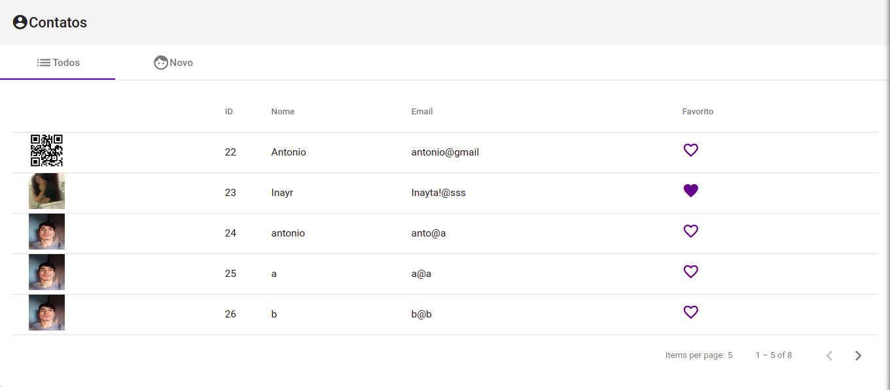
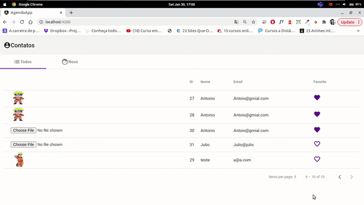
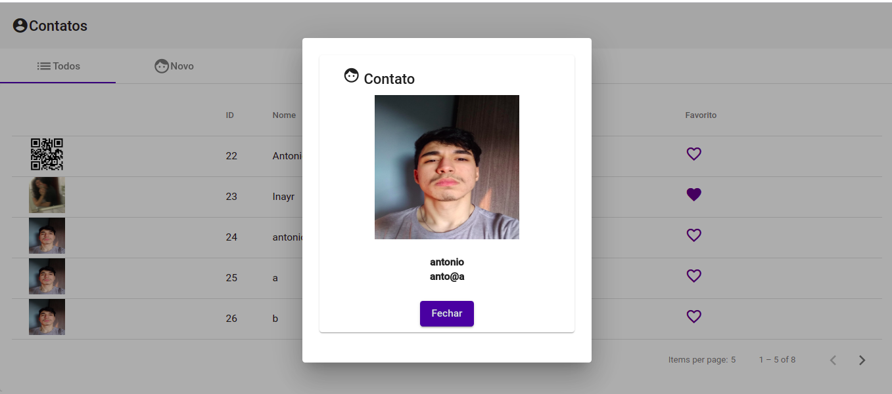

# Agenda - Angular 9 + SpringBoot

Projeto desenvolvido ao longo da segunda parte do curso "Angular9 + Spring Boot". Consiste em uma agenda, na qual o usuário pode inserir, remover e editar contatos.

## Funcionalidade

Há uma API desenvolvida em Spring Boot, na qual é cadastrado/removido/editado no banco de dados os contatos. Além disso, toda a interface é feita com o usuário por meio de uma aplicação Angular que está consumindo esta API Java.

**1 - Listagem dos contatos** - Assim que iniciada a aplicação, há uma listagem de todos os contatos salvos. 

**2 - Favoritar** - É possivel favoritar e desfavoritar, os corações roxo preenchidos são os favoritos.



**3 - Criação de contatos** - Nessa tela o usuário pode criar um novo contato, desde que respeite as regras definidas na validação de nome e email. Após criar, na tela de lista, é possível inserir uma imagem para o contato.



**4 - Cartão de contato** - Ao clicar em um usuário, é possivel ver as informações em forma de cartão.



## Execução

Tanto no Windows quanto no Linux a execução é feita a partir de uma IDE de sua preferência, para executar a API Java. 
A API ficará rodando localmente na porta 8080.

Além da API é necessário executar também a aplicação Angular. Para isso deve-se executar:

```bash
npm install
npm start
```

Esta por sua vez ficará hospedada na porta 4200.
